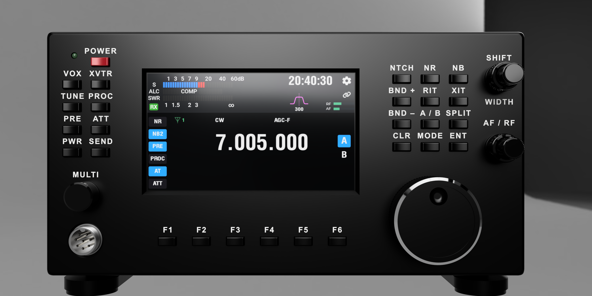
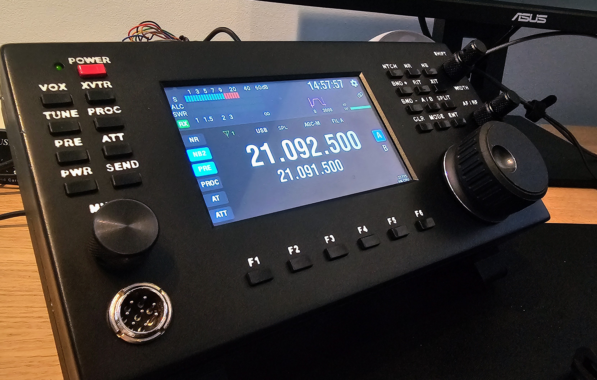

# ARCI Enclosure

ARCI Enclosure is a 3D-printable desktop control console for the
[ARCI](https://github.com/stianeklund/ARCI) amateur-radio control interface.
It holds a 5-inch touchscreen, physical controls, and rear I/O connectors.

Revision 3 uses a parametric design unlike the first prototypes which became a Fusion 360 monstrosity..
Print the main shells on a printer with a build area of at least 256 × 256 mm.

## Features

- Two-piece snap-fit enclosure with front and rear shells
- 45° beveled opening for the Waveshare 5-DSI-TOUCH-A display
- Button matrices, function buttons, and rotary encoder openings
- Label inlays for multi-material printing and printable knurled knobs
- Rear I/O openings for USB, RS-232 (DB9), and Wi-Fi/COM connectors
- Internal mounts for the ARCI PCB, display, and optional USB hub
- M3 and M5 mounting points for assembly
- Adjustable rear tilt stand with 15° click-stop increments

The rear connector layout may change.

## Key specifications

| Item | Specification |
| --- | --- |
| Overall dimensions | 254 × 130 × 54 mm |
| Minimum printer build area | 256 × 256 mm |
| Display | Waveshare 5-DSI-TOUCH-A (MIPI DSI), connected to a ESP32-P4-Wifi6 (Pico?) |
| Main controller | ARCI ESP32-S3 PCB |
| Stand adjustment | 15° increments |

## Build and files

1. Review the [bill of materials](BOM.md).
2. Follow the [printing guide](docs/printing.md).
3. Use the [tilt-stand instructions](docs/tilt-stand.md).

The printable files are in [`export/3mf`](export/3mf). Each 3MF is one
separate print part: shells, knobs, button caps, stand pieces, and mounts are
never bundled as an assembled print job. Matching neutral-CAD part files are
in [`cad/step`](cad/step).

For carry cases, accessory design, and visual fit checks, export the separate
non-printable [`ARCI_ENCLOSURE_INSPECTION.step`](cad/assembly/ARCI_ENCLOSURE_INSPECTION.step)
from the Fusion master. It contains the installed project-authored enclosure,
controls, stand, and Waveshare-compatible display replica; it is not a slicer
input and is intentionally separate from the per-part STEP files.

For the optional USB-hub parts, see the
[USB-hub parts guide](docs/right-matrix-usb-hub-shim.md).

## Display compatibility

The current release supports the Waveshare 5-DSI-TOUCH-A display. The Sunton
ESP32-8048S050C is a fit-check variant only and is not part of this release, but future releases will re-add compatability for this display type.

## Related projects

- [ARCI](https://github.com/stianeklund/ARCI) — firmware and CAT command router
- [ARCI-PCB](https://github.com/stianeklund/ARCI-PCB) — controller PCB
- [RemoteRadioDisplay](https://github.com/stianeklund/RemoteRadioDisplay) — display firmware

## License

This project uses the GPL-3.0 license. See [LICENSE](LICENSE) and
[NOTICE.md](NOTICE.md).
